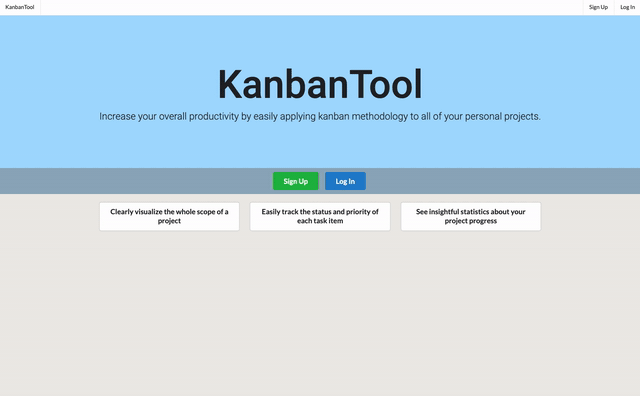
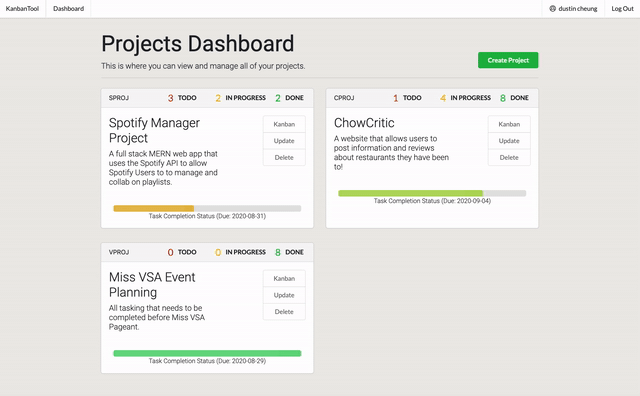
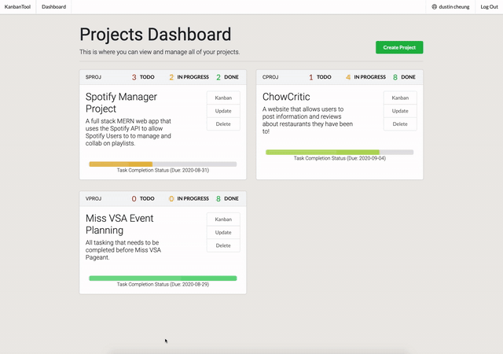
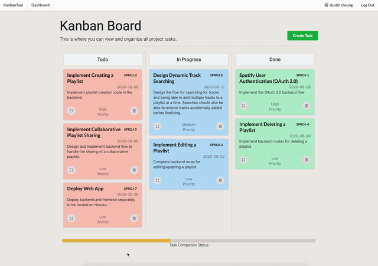

# [KanbanTool](https://mykanbantool.herokuapp.com/):memo:

KanbanTool is a full stack web application built with **React Redux** for the front-end, **Spring Boot** for the **REST API** back-end,
**JPA** for object-relational mapping, and **MySQL** for the database. KanbanTool provides users with a clear easy to use gui so that 
they are able to apply Kanban Methodology to all their personal projects!  More specifically, it allows users to modify and 
manage their personal projects and project's sub tasks while also providing them with insightful statistics about completion.
It supports the following use cases:
* User Authentication (JSON Web Tokens w/ Spring Security)
* creating a project
* editing/updating a project's information
* deleting a project
* adding tasks to a project
* viewing Kanban board where tasks are organized by priority and progress status
* editing/updating a task's details
* deleting tasks from a project
* viewing task completion statistics for a project

## Getting Started:white_check_mark:

:exclamation: Please use Google Chrome :exclamation:

If the app hasn't been accessed recently please give it some time to fully load:  
[KanbanTool is deployed on Heroku here](https://mykanbantool.herokuapp.com/)

Click the link and register an account (if you do not wish to create an account, I demo the functionality below). After signing in you will see your Projects Dashboard populated with your projects.  

If you do not have any projects yet you can create one using the create project button.  Once you have created a project you are able to see its task completion statistics and are also able to modify it using the buttons. 
* Kanban Button: Takes you to the Kanban Board view of the project
* Update Button: Takes you to a form to edit the project
* Delete Button: Allows you to delete the project

In the Kanban Board view of the project you are able to create and manage a project's tasks.  Tasks are ordered by high to low priority and are also seperated by progress status using the following swimlanes: Todo, In Progress and Done.  You can modify a tasks details including its progress status by clicking the expand button in the lower left corner of the task card. 

As you work on your project and update statuses of tasks you will see the task completion progress bar update.  Also in the projects dashboard you will see your project cards update with the most recent number statistics.

## App Demo:apple:
### User Authentication (JWT Spring Security):
* Routes are all protected, if user is not logged in and attempts to access protected route it will redirect to login
* Confirm password validation
* Passwords stored in database using BCrypt encoding

### Project Dashboard: Creating/editing/deleting a project:
* Redux Form validation to ensure correct input
* Backend routes will also respond with displayed errors if form input is not correct

### Kanban Board: Creating/editing/deleting a task:
* Redux Form validation to ensure correct input
* Backend routes will also respond with displayed errors if form input is not correct

### Task Completion Statistics for a Project:
* Showcases task status change and completion progress statistics

## Built With:hammer:
### Front-End:
* [HTML5] - Hypertext Markup Language
* [CSS3] - Cascading Style Sheets
* [React.js](https://reactjs.org) - JavaScript front-end library using components to build user interfaces
* [React-Redux.js](https://reactjs.org) - Predictable state container for JavaScript apps
* [Semantic UI](https://semantic-ui.com) - CSS framework
* [BootStrap 4](https://getbootstrap.com/) - CSS framework
* A little bit of [Semantic UI React](https://react.semantic-ui.com/) - React component library

### Back-End:
* [Spring Boot](https://spring.io/projects/spring-boot) - Java-based framework that takes an opinionated view of Spring to make it easy to build apps
* [Spring Security](https://spring.io/projects/spring-security) - Spring Security is a powerful and highly customizable authentication and access-control framework	
* [MySQL](https://www.mysql.com) - Relational database management system that uses tables
* [JPA](https://spring.io/projects/spring-data-jpa) - handles management of relational data in enterprise Java applications, makes it easy to easily implement JPA based repositories
* [Maven](https://maven.apache.org) - Maven is a build automation and dependency management tool used for Java projects

### Other Significant Packages (Front-End & Back-End):
* [gson](https://github.com/google/gson) - Open-source Java library to serialize and deserialize Java objects to JSON 
* [jjwt](https://mvnrepository.com/artifact/io.jsonwebtoken/jjwt) - Helps to create and verify JWTs
* [jwt-decode](https://www.npmjs.com/package/jwt-decode) - Library that helps decoding JWTs token
* [Axios](https://www.npmjs.com/package/axios) - Promise based HTTP client for the browser and node.js
* [React-router-dom](https://www.npmjs.com/package/react-router-dom) - DOM bindings for React Router
* [Redux-form](https://www.npmjs.com/package/redux-form) - Works with React Redux to enable an html form in React to use Redux to store all of its state
* [Redux-thunk](https://www.npmjs.com/package/redux-thunk) - Middleware for Redux that allows action creators to return async functions, useful for network requests

## Deployment:computer:

* [KanbanTool is deployed on Heroku here](https://mykanbantool.herokuapp.com/)

## Authors:pencil2:

* **Dustin Cheung** - [dustincheung](https://github.com/dustincheung)
